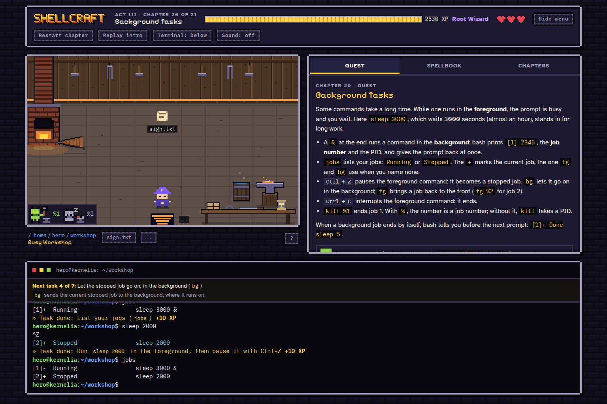
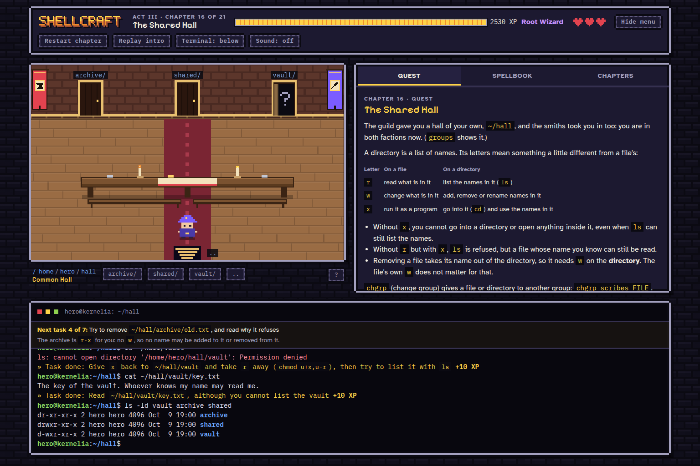
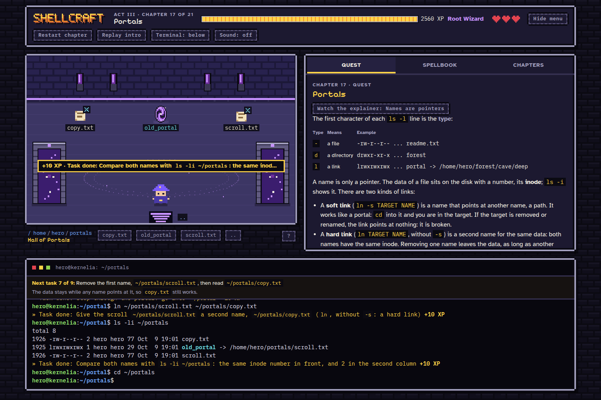
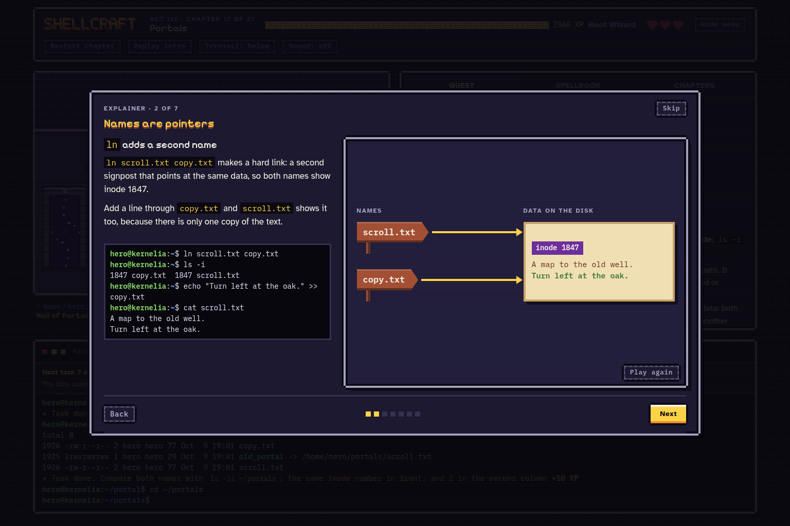

# Shellcraft

Learn Linux commands by exploring a pixel-art world, solving small quests, and trying things in a simulated terminal.



## Install and play

On Ubuntu, including WSL, download or clone this repository and open a terminal inside `shellcraft`. Run:

```sh
./install.sh
./run.sh
```

The installer sets up Node.js if needed and installs the game dependencies. Open [http://127.0.0.1:8765](http://127.0.0.1:8765) to play. Press `Ctrl+C` in the terminal to stop the server.

Your commands affect the game's simulated filesystem. Progress is saved in your browser.

## Screenshots

Directory permissions change which rooms you can enter and what you can do inside them.



Two names can point at the same data. The map and terminal show soft and hard links as you make them.



The visual explainers walk through what the commands change.



Created with help from AI for educational purposes. Licensed under [Apache 2.0](LICENSE).
