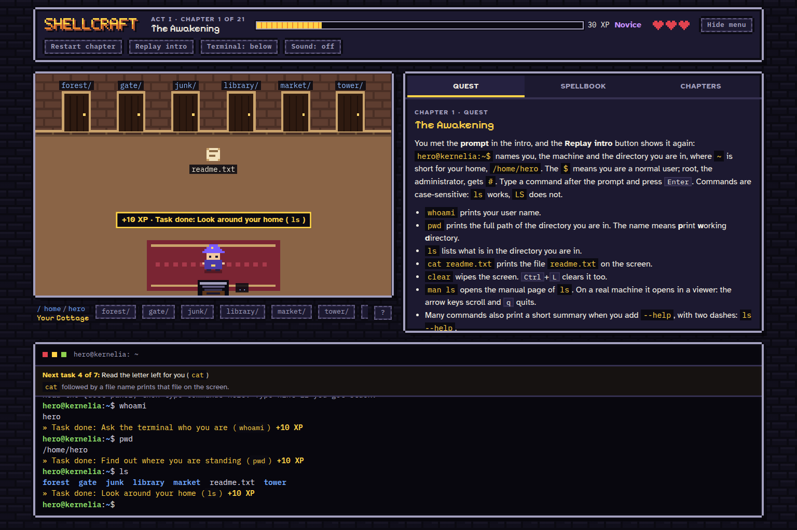
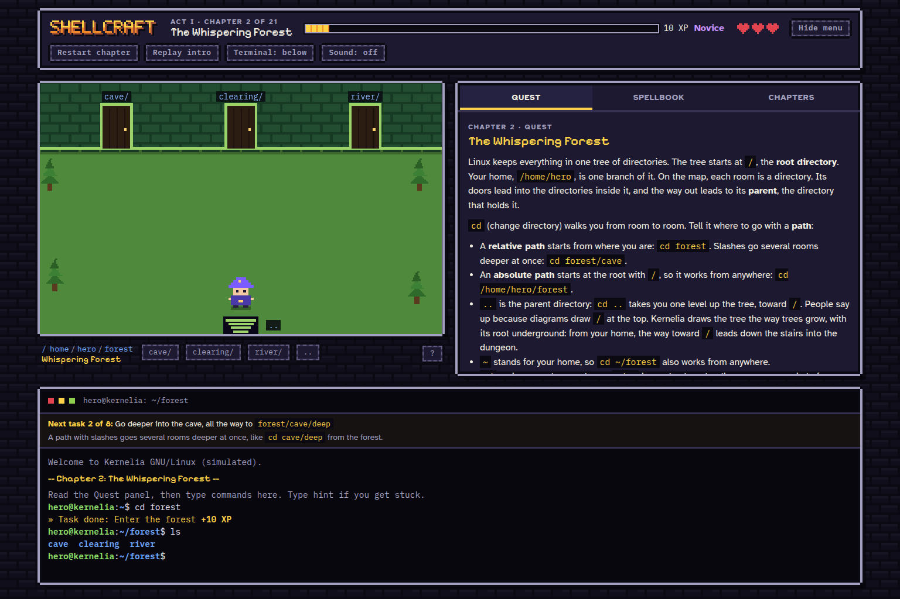
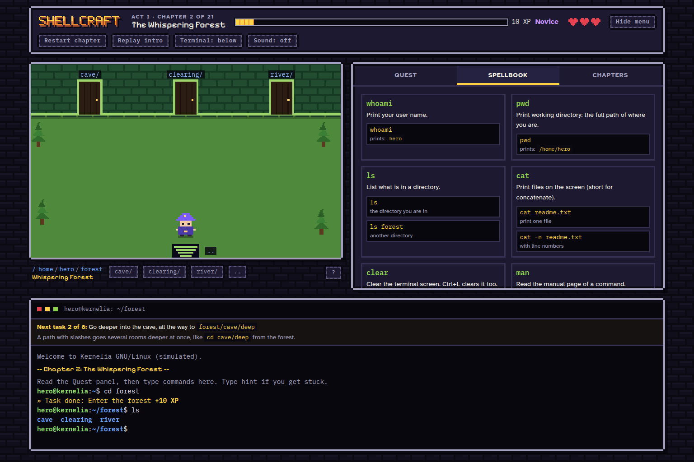

# Shellcraft

Learn Linux commands by exploring a pixel-art world, solving small quests, and trying things in a simulated terminal.

This game was created with help from AI for educational purposes.



## Install and play

On Ubuntu, including WSL, download or clone this repository and open a terminal inside `shellcraft`. Run:

```sh
./install.sh
./run.sh
```

The installer sets up Node.js if needed and installs the game dependencies. Open [http://127.0.0.1:8765](http://127.0.0.1:8765) to play. Press `Ctrl+C` in the terminal to stop the server.

Your commands affect the game's simulated filesystem. Progress is saved in your browser.

## Screenshots

Explore directories and learn commands through guided quests.



Use the spellbook when you need a reminder.


